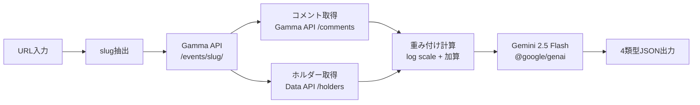

# Polymarket市場分析

PolymarketのURLを入力すると、コメント欄から価格変動の理由をAIが分析し、大口ホルダーの意見や反対意見、トリガー条件をまとめて表示するツールです。

## 機能

- Polymarket市場データの自動取得（Gamma API + Data API）
- コメントの重み付け分析（ホルダーポジション + いいね数）
- Gemini 2.5 FlashによるAI分析
  - 価格変動の理由
  - 大口ホルダーの主張
  - 反対意見
  - 次に動く条件（トリガー）

## アーキテクチャ全体像



### ステップ1: データ取得（Gamma API + Data API）

URLからslugを抽出し、Gamma APIとData APIの2つを使ってデータを取得します。

```typescript
// 1. URLからslugを抽出
const slug = url.pathname.split("/").filter(Boolean)[1];
// 例: "which-company-has-the-best-ai-model-end-of-january"

// 2. Gamma APIで市場データ取得
const event = await fetch(
  `https://gamma-api.polymarket.com/events/slug/${slug}`
);

// 3. コメントは別エンドポイントから取得（いいね数順）
const comments = await fetch(
  `https://gamma-api.polymarket.com/comments?parent_entity_type=Event&parent_entity_id=${eventId}&get_positions=true&order=reactionCount&limit=100`
);

// 4. 大口ホルダーはData APIから取得
const holders = await fetch(
  `https://data-api.polymarket.com/holders?market=${conditionIds.join(",")}&limit=20`
);
```

**ポイント**:
- Gamma API（市場情報・コメント）とData API（ホルダー）の2つを使用
- コメントはいいね数順で取得し、ポジション情報も同時に取得
- ホルダーは市場のconditionIdを使ってData APIから取得

### ステップ2: 重み付け計算

3つの要素を対数スケール＋加算方式でスコアリングします。

```typescript
let weight = 1.0;

// Factor 1: ポジション保有量（対数スケール）
if (hasDirectPositions) {
  const totalPosition = positions.reduce(
    (sum, p) => sum + parseFloat(p.positionSize || "0"), 0
  );
  weight += Math.log10(Math.max(totalPosition, 1)) * 0.5;
}

// Factor 2: Top Holderとの一致（ボーナス）
if (holder) {
  const holdingsValue = parseFloat(holder.holdings.replace(/[^0-9.]/g, ""));
  weight += Math.log10(Math.max(holdingsValue, 1)) * 0.3;
}

// Factor 3: いいね数（上限2.0）
const reactions = comment.reactionCount || 0;
if (reactions > 0) {
  weight += Math.min(reactions * 0.1, 2.0);
}
```

**ポイント**:
- 単純な掛け算ではなく、対数スケール + 加算方式で極端な偏りを防止
- 大口ホルダーのコメント（最大20件）+ 一般コメント（最大30件）をAIに送信
- ホルダーの照合はユーザー名・ウォレットアドレスの複数戦略で実施

### ステップ3: Gemini AI分析

`@google/genai` パッケージでGemini 2.5 Flashを呼び出します。

```typescript
import { GoogleGenAI } from "@google/genai";

const genAI = new GoogleGenAI({ apiKey: process.env.GOOGLE_GENERATIVE_AI_API_KEY });

const response = await genAI.models.generateContent({
  model: "gemini-2.5-flash",
  contents: prompt,
  config: {
    responseMimeType: "application/json", // JSON形式で出力を強制
    temperature: 0.7,
  },
});

const analysis = JSON.parse(response.text);
// → { reasons, whaleOpinions, opposingViews, triggers }
```

**ポイント**:
- `responseMimeType: "application/json"` でJSON出力を強制
- temperature 0.7 で適度な創造性を維持
- レート制限時はフォールバック分析（大口コメントの直接表示）に切り替え

## セットアップ

### 必要なもの

- Node.js 20+
- pnpm
- Google AI Studio APIキー

### インストール

```bash
pnpm install
```

### 環境変数

`.env.local`を作成し、以下を設定：

```
GOOGLE_GENERATIVE_AI_API_KEY=your_api_key_here
```

APIキーは[Google AI Studio](https://aistudio.google.com/apikey)から取得できます。

### 開発サーバー起動

```bash
pnpm dev
```

[http://localhost:3000](http://localhost:3000)を開く。

## 使い方

1. PolymarketのイベントURLを入力
   - 例: `https://polymarket.com/event/which-company-has-the-best-ai-model-end-of-january`
2. 「分析開始」ボタンをクリック
3. AI分析結果を確認

## 技術スタック

- **フレームワーク**: Next.js 16 (App Router)
- **UI**: React 19, Tailwind CSS 4
- **データフェッチング**: TanStack Query
- **AI**: Google Gemini 2.5 Flash (`@google/genai`)
- **Markdown表示**: react-markdown
- **リンター/フォーマッター**: Biome

## スクリプト

```bash
pnpm dev      # 開発サーバー
pnpm build    # プロダクションビルド
pnpm start    # プロダクションサーバー
pnpm lint     # リントチェック
pnpm format   # フォーマット
```

## API

### POST /api/analyze

市場URLを受け取り、分析結果を返す。

**リクエスト:**

```json
{
  "url": "https://polymarket.com/event/..."
}
```

**レスポンス:**

```json
{
  "marketUrl": "...",
  "marketTitle": "...",
  "marketDescriptionSummary": "解決条件の要約（Markdown形式）",
  "currentSituation": {
    "priceChange": "1強 | 急変 | 均衡",
    "dominantOption": "OpenAI 45.3%"
  },
  "marketOptions": [
    { "name": "OpenAI", "price": 45.3, "volume": 1234567 }
  ],
  "reasons": ["理由1", "理由2", "理由3"],
  "whaleOpinions": [
    { "holder": "ホルダー名", "position": "1.23M shares", "comment": "主張" }
  ],
  "opposingViews": ["反対意見1", "反対意見2"],
  "triggers": ["トリガー1", "トリガー2"],
  "metadata": {
    "analyzedAt": "2025-02-10T...",
    "commentCount": 42,
    "whaleCount": 20
  }
}
```
